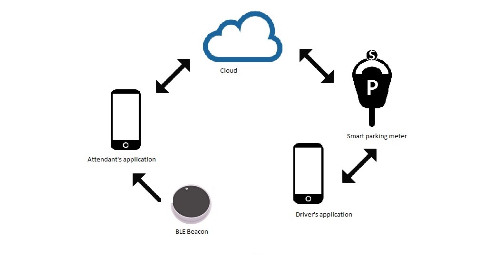

# SPARK

The SPARK system consists of driver application, attendant application, smart parking meter, BLE beacon(s) and cloud.
Please find more detailed information about each component in their respective directories.

   
  <i>Overview of the system</i>

Find information about the project goals and reasoning on the project website
https://drivercity.github.io/index.html

