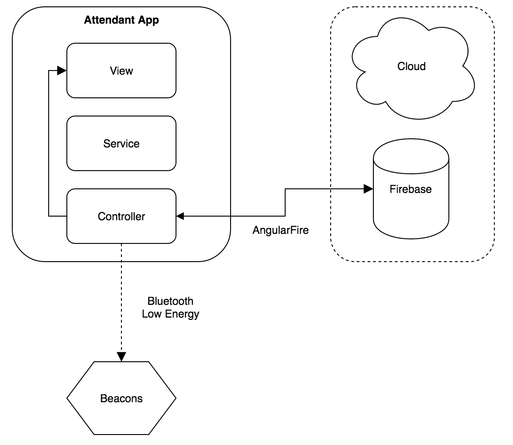

# Attendant app architecture

This document describes attendant app architecture on high level. Please refer to code documentation for more detailed description on attendant app's components.

## Overview

Attendant app consists of several controllers, which manage the different states for the application. The attendant app communicate with several third part of the system using following methods:
- **Bluetooth low energy** is used to detected beacons.
- **AngularFire** is a library used to create syncrhonized array based on Firebase references. All the information retrieved from Firebase use this type of array.

The picture below illustrate the driver app architecture.

   
  <i>Architecture diagram</i>

