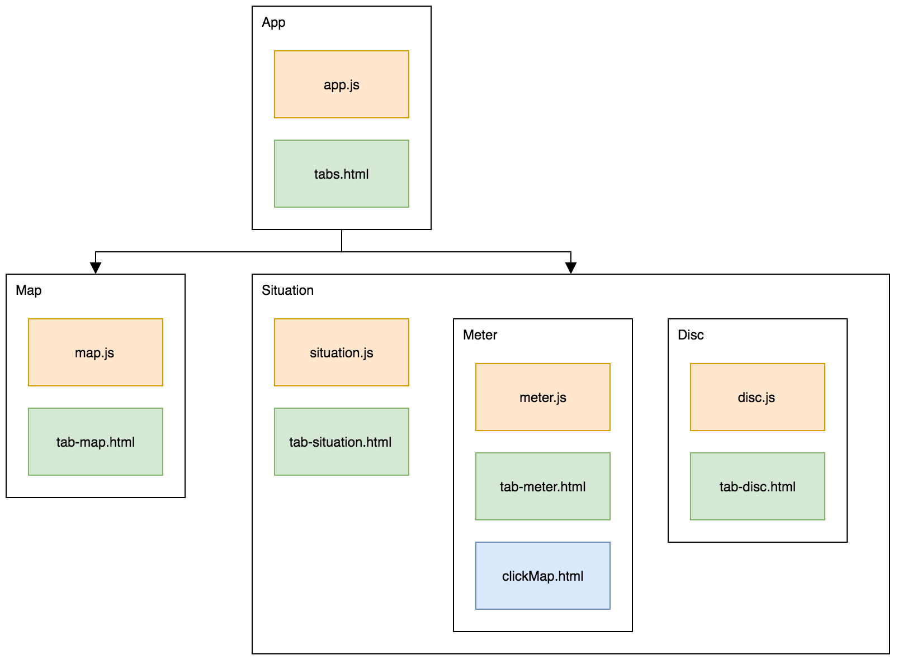

# Attendant app components

Applications is divided in several components which propose the app's functionalities. The following diagram present the different components of the attendant app.

   
  <i>Components organisation diagram</i>

### Map
- **Role** : Display in real-time occupancy for paid parking in Tampere
- **Special dependencies** : [Google Map API](https://developers.google.com/maps/web-services/), [Cordova geolocation](https://github.com/apache/cordova-plugin-geolocation)

### Situation
- **Role** : Detect beacons and verify parking validity
- **Special dependencies** : [Cordova Bluetooth Low Energy](https://github.com/don/cordova-plugin-ble-central)