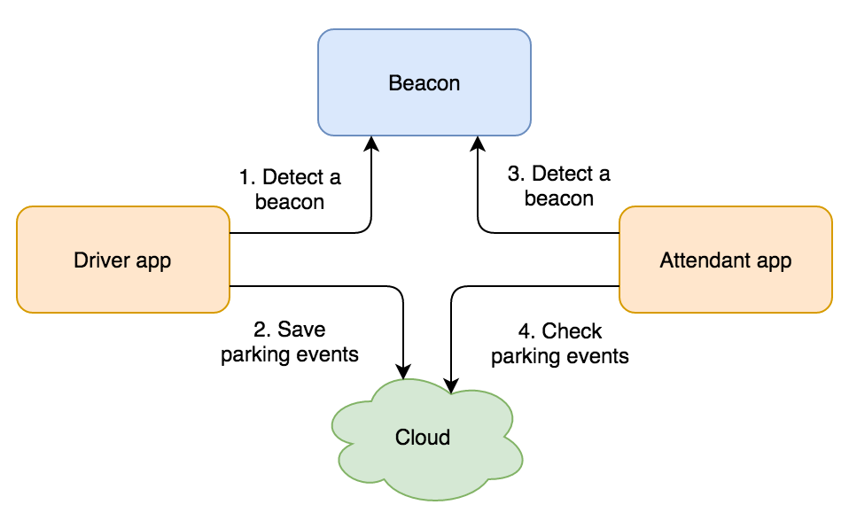

# Documentation

This section is dedicated to the driver app specific documentation. For more general information about technologies used, please refer to the common documentation for mobile apps.

> **Note:** This documentation is under redaction, and will evolve during the project's development

## Reminder about general process

   
  <i>Process diagram</i>

## Parts

- [Environment's installation](install-environment.md)
- [Architecture](architecture.md)
- [Components](components.md)
