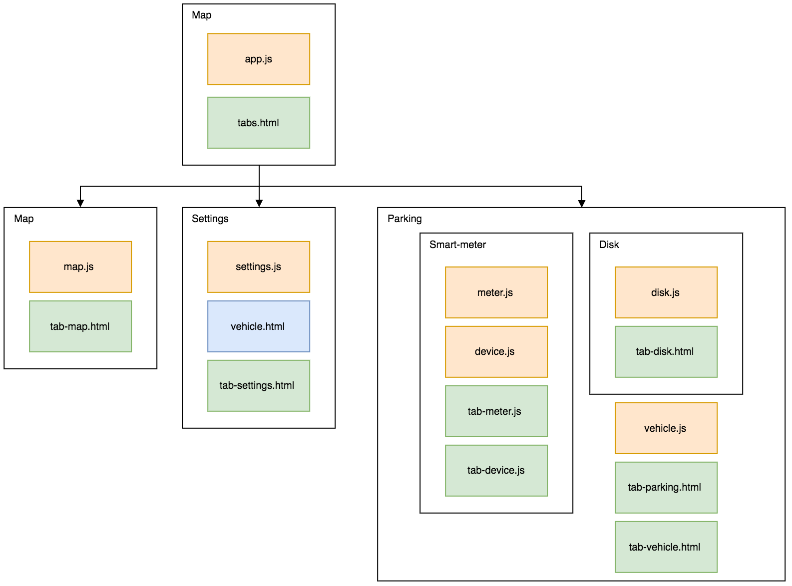

# Driver app components

Applications is divided in several components which propose the app's functionalities. The following diagram present the different components of the driver app.

   
  <i>Components organisation diagram</i>

### Map
- **Role** : Display in real-time occupancy for paid parking in Tampere
- **Special dependencies** : [Google Map API](https://developers.google.com/maps/web-services/), [Cordova geolocation](https://github.com/apache/cordova-plugin-geolocation)

### Settings
- **Role** : Manage his list of vehicle
- **Special dependencies** : [Browser local storage](https://medium.com/@petehouston/awesome-local-storage-for-ionic-with-ngstorage-c11c0284d658#.jvwjri6fw)

### Parking
- **Role** : Send a parking event to the right entity (Cloud or smart meter)
- **Special dependencies** : [Cordova Bluetooth Low Energy](https://github.com/don/cordova-plugin-ble-central)
